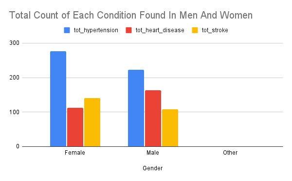
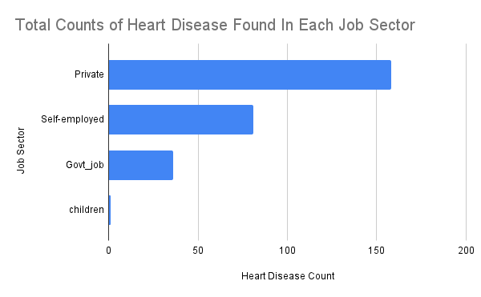
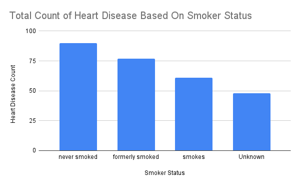

# stroke-risk-sql-analysis
This project analyzes publicly available stroke dataset records using SQL. Queries were written to examine demographic differences, cardiovascular risk factors, and stroke prevalence by gender, employment type, and smoking status.

# Stroke Risk Analysis (SQL Project)

## Project Overview

This project analyzes patient-level stroke data using SQL to evaluate
risk factor distribution, demographic trends, and condition prevalence.

The goal was to demonstrate SQL proficiency in:

- Aggregation using AVG() and COUNT()
- Conditional counting with CASE statements
- Percentage calculations
- GROUP BY analysis
- Data cleaning with COALESCE()
- Clinical risk interpretation

## Dataset

Stroke Dataset
Source: Public healthcare dataset (CSV format)

Table: stroke_data

Key Variables:
- gender
- age
- hypertension (0/1)
- heart_disease (0/1)
- stroke (0/1)
- avg_glucose_level
- bmi
- work_type
- smoking_status

## Key Questions Explored

1. What are the average glucose levels for men vs. women.
2. What is the average age of stroke victims by gender?
3. Which employment types show the highest counts of heart disease?
-- 4. How does smoking status relate to heart disease prevalence?
-- 5. What is the average BMI of individuals diagnosed with hypertension?
-- 6. What are the total counts of hypertension, heart disease, and stroke by gender?
-- 7. What percentage of men and women experience stroke?

## Key Findings

--1. Avg. glucose level in women was 104.1 while in men the average level was 109.1. Showing men having a higher average glucose level than women.
--2. The average age of stroke victims identifying as women was 67.1 years of age while in men it was 68.5 years of age. Showing women having a younger onset age for stroke risk
--3. Those employed in the private sector have a higher prevalence of heart diseasewith a total of 158 counts. 
--4. Participants who reported never smoking had a higher count of reported heart disease than those who reported smoking at some point.
--5. The average bmi of women with hypertension was 30.0 while the average bmi of men was 29.9, showing that bmi has a similar effect regardless of gender.
--6. Women have a higher reported count of hypertension and strokes while men have a higher count for heat disease.
--7.Wmone were shown having a %4.7 chance of having a stroke while men showed %5.11 chance.

## Visualizations

## Tools Used

-- SQLite
-- SQL (AVG, COUNT, CASE, COALESCE, ROUND, GROUP BY, ORDER BY)
-- CSV dataset import
-- GitHub (project documentation)

## Skills Demonstrated

- Clinical data aggregation
- Conditional logic with CASE statements
- Risk percentage calculation
- Handling missing categorical values
- Healthcare risk factor analysis
- Analytical reporting using SQL

